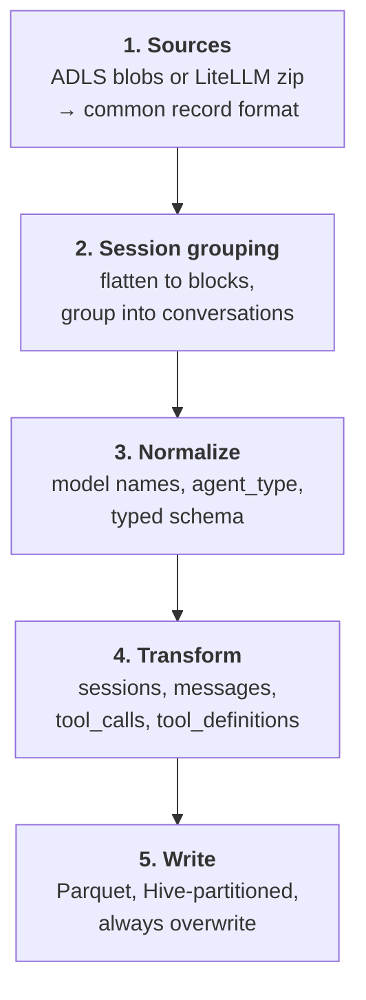

The design specified in [[project/epic-and-issues]] issue #1 and assembled by
issue #8's `data/pipeline.py`.

## Stages



| Stage            | Module                          | Concept                             |
| ---------------- | ------------------------------- | ----------------------------------- |
| Sources          | `data/sources.py`               | [[pipeline/source-adapters]]        |
| Session grouping | ported from `group_sessions.py` | [[upstream/session-reconstruction]] |
| Normalize        | `data/schema.py`                | [[pipeline/analytics-schema]]       |
| Transform        | `data/transform.py`             | [[pipeline/analytics-schema]]       |
| Write            | `data/storage.py`               | [[pipeline/storage-layout]]         |

State tracking (`data/state.py`) runs alongside — see
[[pipeline/idempotency-design]].

## The entry point

```python
def run_pipeline(
    source_mode: Literal["adls", "litellm", "auto"],
    adls_source: str | None,
    litellm_env_file: Path | None,
    output: str,
    instance_id: str,
    from_date: date,
    to_date: date,
    full_refresh: bool = False,
    lookback_days: int = 7,
) -> PipelineRunStats
```

`PipelineRunStats` is where coverage problems surface. At minimum it must carry
`skipped_session_count` (see [[caveats/end-user-parsing]]); the count of failed
response reads from [[caveats/responses-api-gap]] belongs there too.

## The layering rule

!!! important "The transform core imports nothing from Azure"

    Issue #1 requires the core transform to be pure Python plus `polars`, with
    **zero Azure imports**. Cloud access is confined to `data/sources.py` and
    `data/storage.py`, and even there `adlfs` is imported behind a guard.

Three things follow:

- **Testability.** [[pipeline/analytics-schema]]'s transforms are tested against
  JSON fixtures on local disk with no cloud credentials and no mocking
  framework.
- **Portability.** The same code runs against `file://` in a notebook and
  `abfs://` in production, with only a URL changing.
- **Reviewability.** A change to transform logic cannot accidentally change I/O
  behavior, because the transform layer has no I/O to change.

## Polars, not pandas

Upstream [[upstream/reader-flattening]] returns pandas DataFrames, and the
pipeline reuses those functions. The new transform layer is `polars`. That split
is deliberate: existing tested logic stays as-is rather than being rewritten,
while new code gets Polars' lazy evaluation, explicit typed schemas, and
stronger Arrow integration — all of which matter when the output contract is
Parquet with fixed types (`timestamp[us, UTC]` and friends).

The conversion happens at the stage-2/stage-3 boundary.

## Always overwrite, never append

Every write replaces a partition rather than adding to it. This is what makes
reruns safe and is treated fully in [[pipeline/idempotency-design]].

## Related Concepts

- [Analytics Schema — Four Tables](analytics-schema.md): The transform stage's
  output is exactly the four tables defined in the schema.
- [Source Adapters and Auto Detection](source-adapters.md): Stage one of this
  architecture is the source adapter layer.
- [Idempotency: Manifest and Partition Overwrite](idempotency-design.md): The
  always-overwrite rule stated here is made safe by the manifest and
  partition-overwrite mechanics.
- [Epic #1 and the Implementation Issues](../project/epic-and-issues.md): The
  issue breakdown maps each stage of this architecture onto a specific
  implementation issue.
