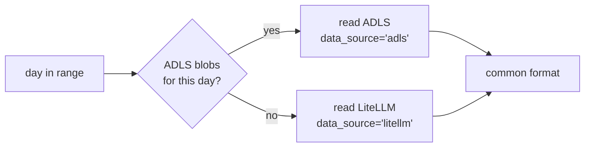

`data/sources.py` (issue #3 of [[project/epic-and-issues]]) is the boundary that
keeps the rest of the pipeline from knowing which of the
[[platform/logging-paths]] a record came from.

## Interface

```python
from_adls(record)   -> dict   # reshape kwargs.standard_logging_object
from_litellm(record) -> dict  # pass-through
iter_source(date, mode, adls_fs, litellm_client)
```

The LiteLLM spend-log row shape **is** the common format, so `from_litellm` is a
pass-through and `from_adls` does the work — the reshaping first prototyped as
`_adls_record_to_spend_log_shape` in [[upstream/session-reconstruction]].

Choosing the spend-log shape as canonical was not arbitrary: it is what
[[upstream/reader-flattening]] already consumes, so all of the existing, tested
flattening logic is reused unchanged.

!!! important "The identical-output requirement"

    Issue #3 states the acceptance criterion directly: both adapters must
    produce **identical** common-format output for equivalent input. This is
    what makes `data_source` a purely descriptive tag rather than a branch
    condition — downstream code never needs to ask where a record came from.

    A fixture-based test asserting field-by-field equality between an ADLS
    record and its LiteLLM counterpart is the way this stays true; issue #11
    provides those fixtures.

## Auto mode resolves per day

`iter_source` takes `mode` as `adls`, `litellm`, or `auto`. Auto resolution
happens **per day**, not once per run.

That design follows from [[platform/llmoxie-timeline]]: `AdlLogger` landed
2026-05-08, so there is a hard boundary in history. Days before it have no ADLS
blobs at all; days after it have both. Any backfill spanning the boundary must
switch backends mid-run.



Auto mode is therefore a correctness requirement for historical backfill, not a
convenience feature.

## Preference order

ADLS wins whenever it is available, because its message bodies are untruncated —
see [[platform/logging-paths]]. But recall from [[platform/adls-logger]] that
ADLS writes fail silently, so "no blobs for this day" is ambiguous: it may mean
the day predates the logger, or that writes failed.

For a day after 2026-05-08, an empty ADLS read that falls back to LiteLLM is
worth flagging rather than passing over quietly. The `data_source` distribution
in the output makes this auditable after the fact:

```sql
SELECT start_date, data_source, COUNT(*)
FROM sessions GROUP BY 1, 2 ORDER BY 1;
```

An `'litellm'` row on a recent date is a signal to investigate the logger.

## Credentials differ by mode

`adls` and `auto` need `AZURE_STORAGE_CONNECTION_STRING`; `litellm` needs
`LITELLM_MASTER_KEY` and `LITELLM_BASE_URL`. [[pipeline/pipeline-cli]] validates
the right set up front rather than failing partway through a run.

## Related Concepts

- [The Two Logging Paths](../platform/logging-paths.md): The two logging paths
  are precisely the two sources these adapters reconcile.
- [Storage Layout and Parquet I/O](storage-layout.md): The adapters sit directly
  above the I/O layer that fetches raw bytes.
- [Pipeline Architecture](pipeline-architecture.md): Source adaptation is stage
  one of the overall pipeline design.
