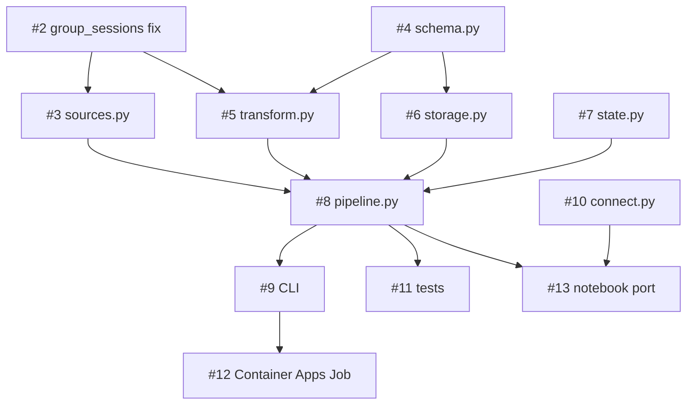

[Issue #1](https://github.com/uw-ssec/llmoxie-analysis/issues/1) is the epic. It
specifies the four-stage pipeline, the `--source` modes, the always-overwrite
rule, the output path convention, the two-engine query layer, and the two-layer
idempotency design. Issues #2–#13 break that into units of work.

Sub-issue #2 is **done** (PR uw-ssec/llmoxie#151 merged 2026-09-12, ticket closed 2026-09-20); the remaining eleven are open and labelled `enhancement`.

## The breakdown

| Issue                                                        | Deliverable                                                   | Documented in                       |
| ------------------------------------------------------------ | ------------------------------------------------------------- | ----------------------------------- |
| [#2](https://github.com/uw-ssec/llmoxie-analysis/issues/2)   | Fix and merge `group_sessions.py` from upstream               | [[upstream/session-reconstruction]] |
| [#3](https://github.com/uw-ssec/llmoxie-analysis/issues/3)   | `data/sources.py` — ADLS and LiteLLM adapters, auto detection | [[pipeline/source-adapters]]        |
| [#4](https://github.com/uw-ssec/llmoxie-analysis/issues/4)   | `data/schema.py` — the four table definitions                 | [[pipeline/analytics-schema]]       |
| [#5](https://github.com/uw-ssec/llmoxie-analysis/issues/5)   | `data/transform.py` — session objects to DataFrames           | [[pipeline/analytics-schema]]       |
| [#6](https://github.com/uw-ssec/llmoxie-analysis/issues/6)   | `data/storage.py` — readers, atomic Parquet writer            | [[pipeline/storage-layout]]         |
| [#7](https://github.com/uw-ssec/llmoxie-analysis/issues/7)   | `data/state.py` — the content-hash manifest                   | [[pipeline/idempotency-design]]     |
| [#8](https://github.com/uw-ssec/llmoxie-analysis/issues/8)   | `data/pipeline.py` — the orchestration entry point            | [[pipeline/pipeline-architecture]]  |
| [#9](https://github.com/uw-ssec/llmoxie-analysis/issues/9)   | `llmaven data pipeline run` CLI                               | [[pipeline/pipeline-cli]]           |
| [#10](https://github.com/uw-ssec/llmoxie-analysis/issues/10) | `data/connect.py` — `open_db()`                               | [[pipeline/query-layer]]            |
| [#11](https://github.com/uw-ssec/llmoxie-analysis/issues/11) | `data/tests/` — fixtures and the byte-identical rerun test    | [[pipeline/idempotency-design]]     |
| [#12](https://github.com/uw-ssec/llmoxie-analysis/issues/12) | Azure Container Apps Job, gated by `enable_pipeline_job`      | [[pipeline/container-apps-job]]     |
| [#13](https://github.com/uw-ssec/llmoxie-analysis/issues/13) | Port `data/analysis.ipynb` to DuckDB + Parquet                | [[pipeline/query-layer]]            |

## Dependency order



**#2 is the real prerequisite — and it is done.** PR uw-ssec/llmoxie#151 merged
on 2026-09-12 with the defects from [[upstream/session-reconstruction]]
repaired, and the `reference/llmoxie` submodule pin carries that revision, so
both the adapters (#3) and the transform (#5) can now build directly on the
session objects it produces. The caveats recorded in
[[caveats/dedup-vs-last-request]] and [[caveats/responses-api-gap]] were
discovered inside it; merging it first means those behaviors are fixed in one
place rather than reproduced in two.

**#4, #7, and #10 have no upstream dependency.** The schema is a set of
declarations, the state manifest is self-contained JSON bookkeeping, and
`open_db()` only needs Parquet files to exist eventually — not now. These three
can proceed in parallel with #2 from day one.

**#8 is the convergence point.** Nothing downstream of it can start until the
orchestration entry point exists, and everything upstream of it must land first.
It is the schedule's critical path.

**#12 and #13 are independent leaves.** Deployment and the notebook port touch
nothing else and can be deferred without blocking anything.

## What "done" means for the epic

Issue #1 gives its own acceptance check, and it is a good one because it
exercises both source modes and the query layer in three commands:

```bash
llmaven infra extract --source litellm \
  --from 2026-08-01 --to 2026-09-08 --out /tmp/raw.zip

python -m data.pipeline --instance test --source litellm \
  --from 2026-08-01 --to 2026-09-08 \
  --adls-source /tmp/raw.zip --output /tmp/out/

duckdb -c "SELECT data_source, COUNT(*)
           FROM read_parquet('/tmp/out/sessions/**/*.parquet',
                             hive_partitioning = true)
           GROUP BY 1"
```

!!! note "Passing this check is necessary, not sufficient"

    It proves the pipeline runs end to end over one source. It does not prove
    idempotency (#11's byte-identical rerun test does), and it does not prove
    that `auto` correctly straddles the 2026-05-08 cutover — for that, run the
    same range in `auto` mode and confirm the `data_source` counts split across
    the boundary as [[pipeline/source-adapters]] predicts.

## Related Concepts

- [LLMoxie Analysis](llmoxie-analysis.md): The project these issues collectively
  deliver.
- [Pipeline Architecture](../pipeline/pipeline-architecture.md): The design that
  issues #3 through #9 implement stage by stage.
- [group_sessions.py — Reconstructing Conversations](../upstream/session-reconstruction.md):
  Issue #2, the prerequisite that unblocks most of the graph.
- [OKF Bundle Conventions](okf-conventions.md): How this knowledge
  base is kept in step with the issues as they close.
