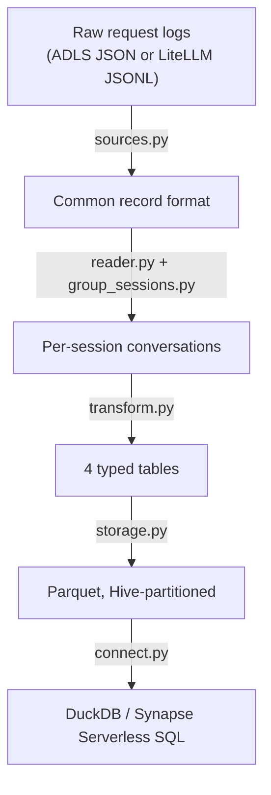

`uw-ssec/llmoxie-analysis` is the home of the LLMoxie data analysis package. Its
job is narrow and well-defined: take the raw per-request logs that the
[[platform/llmoxie-platform]] gateway emits, reconstruct them into
conversational sessions, normalize them into a stable analytical schema, and
write them to Parquet so researchers can answer questions about how the gateway
is actually being used.

## Why this repo exists separately

The gateway repo (`uw-ssec/llmoxie`) owns _production_ concerns — the proxy, the
infrastructure-as-code, the logging callbacks. Analysis has a different release
cadence, a different dependency set (`polars`, `duckdb`, `pyarrow`), and a
different risk profile. Splitting it means an analyst can iterate on the
transform layer without touching anything that serves live traffic.

The pieces that already exist upstream — [[upstream/reader-flattening]] and
[[upstream/session-reconstruction]] — are reused rather than rewritten. This
repo adds the layers around them: source adapters, a typed schema, idempotent
writes, and a query surface.

## The shape of the work

Each arrow is a module with a single responsibility; see
[[pipeline/pipeline-architecture]] for the stage boundaries and the rule that
keeps Azure imports out of the core transform.

## What makes this data hard

Four things, all of which have bitten the existing prototype and all of which
the pipeline must handle explicitly rather than silently:

- Session identity is recovered from a free-text field and often fails —
  [[caveats/end-user-parsing]]
- Costs and tokens are reported per request over resent history, so naive sums
  double-count — [[caveats/cost-token-double-counting]]
- Two different deduplication strategies exist and are not interchangeable —
  [[caveats/dedup-vs-last-request]]
- Responses-API traffic has a reply shape the reader does not parse —
  [[caveats/responses-api-gap]]

The analytical schema carries a `data_source` column precisely so that these
fidelity differences stay visible at query time rather than being averaged away.
See [[pipeline/analytics-schema]].

## Current status

Nothing is implemented yet. The design lives in [[project/epic-and-issues]] as a
twelve-issue breakdown under a single epic. The prerequisite is upstream:
`uw-ssec/llmoxie#151` must merge before the source adapters can rely on
`group_sessions.py`.

## Related Concepts

- [LLMoxie Platform](../platform/llmoxie-platform.md): The platform's LiteLLM
  gateway is what produces the data this repository analyzes.
- [Pipeline Architecture](../pipeline/pipeline-architecture.md): The four-stage
  design is what this repository is being built to implement.
- [Epic #1 and the Implementation Issues](epic-and-issues.md): The epic and its
  sub-issues are the issue-by-issue work plan for that implementation.
- [OKF Bundle Conventions](okf-conventions.md): This knowledge base
  is itself a deliverable, maintained under the conventions described there.
- [Cross-VISS Demo and the Repository's Two Purposes](cross-viss-demo.md): Why this repository's scaffolding is further along than its analysis code, and which audience each part serves
